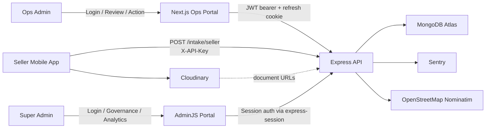
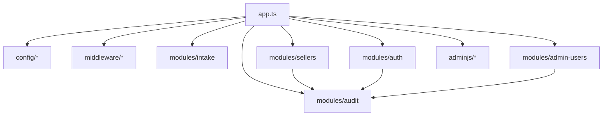
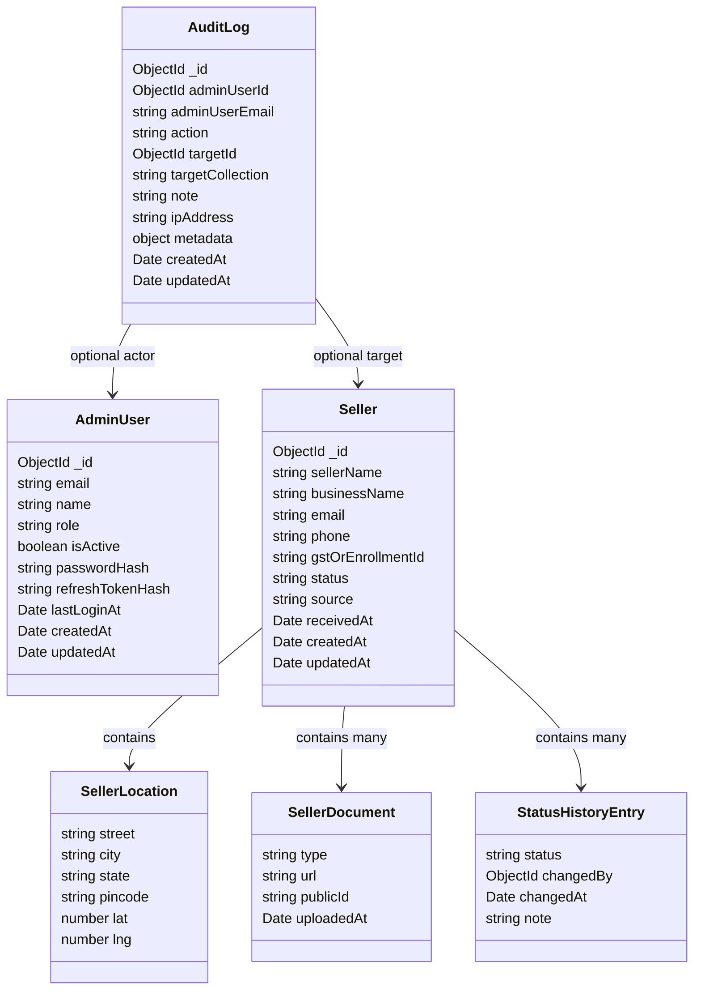
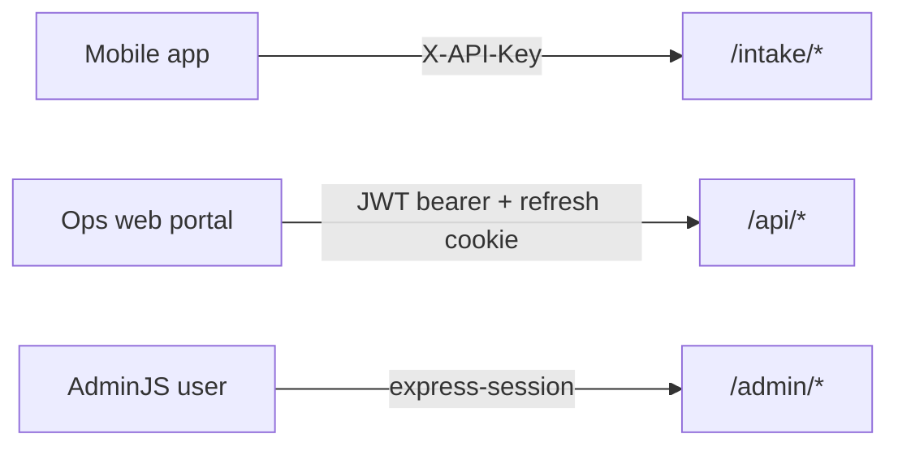
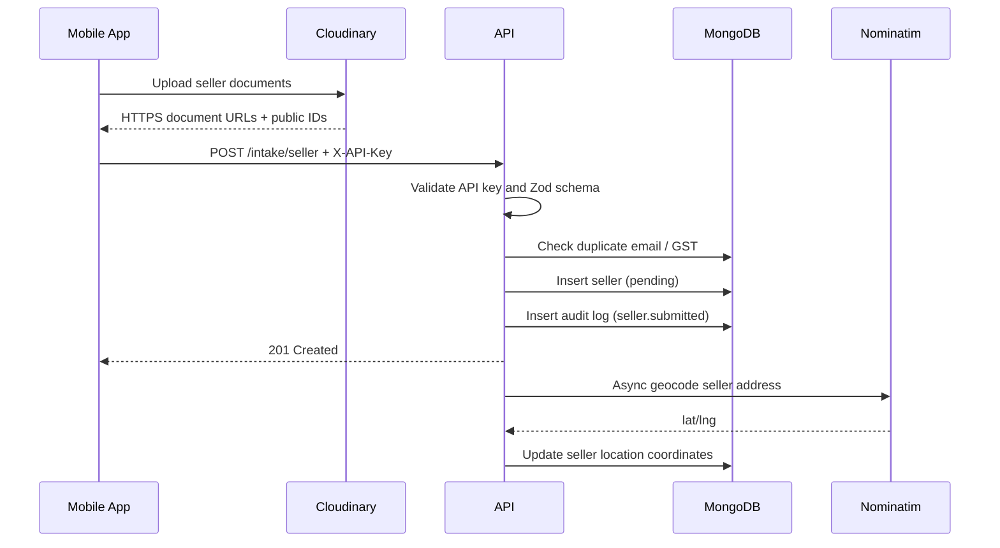
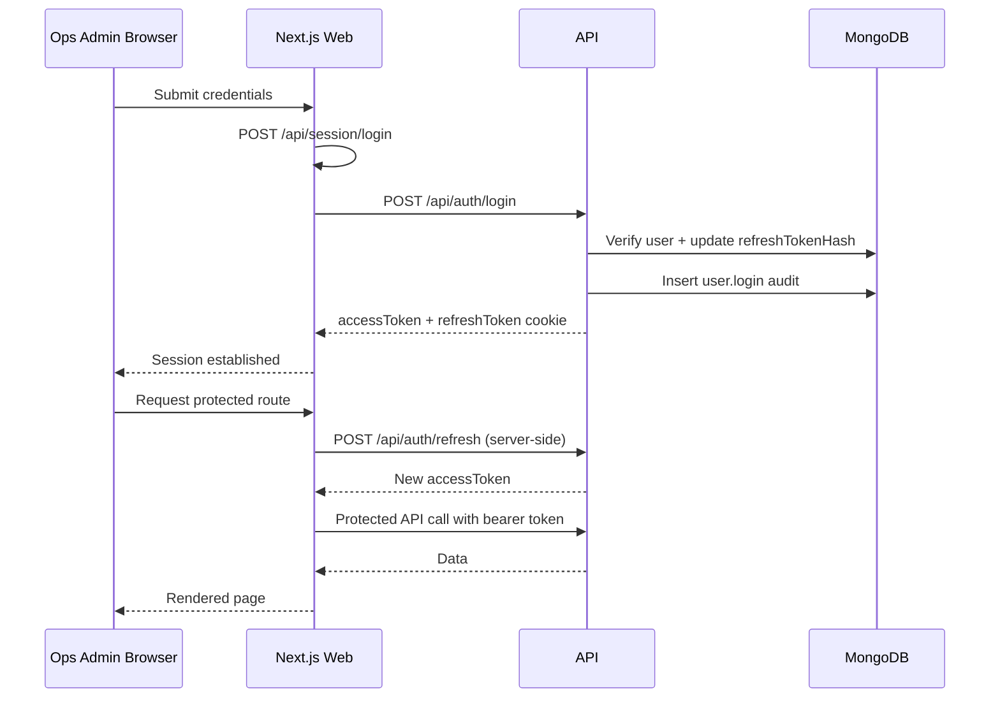
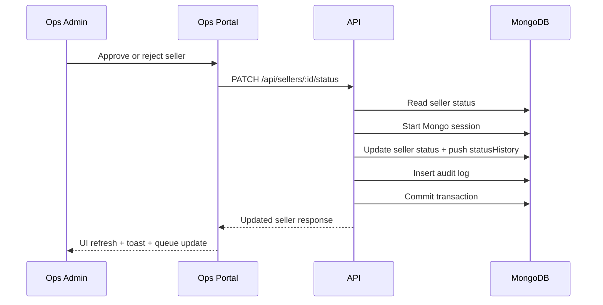
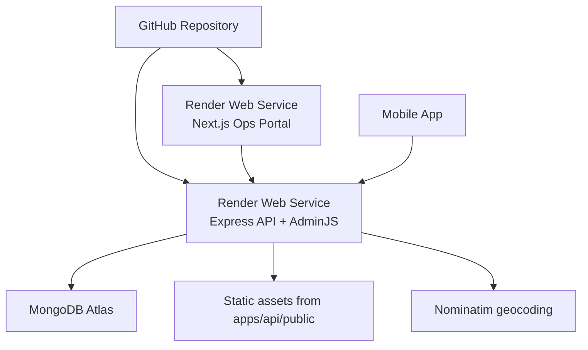

# Zatch Internal Portal

## Architecture Document

### Revision

- **Document type:** Production implementation architecture
- **System:** Zatch Internal Portal
- **Scope covered:** Ops web portal, AdminJS portal, API, shared contracts, MongoDB, and deployment topology
- **Status:** Reflects the codebase currently present in this repository

---

## 1. Executive Summary

Zatch Internal Portal is a production-oriented internal operations platform for seller onboarding review. It serves three distinct operator journeys:

1. **Mobile intake ingestion** from an external mobile app using an API-key-protected endpoint
2. **Ops workflow management** through a custom Next.js web portal for reviewing, approving, and rejecting sellers
3. **Super-admin governance and analytics** through a customized AdminJS control plane mounted on the API service

The platform is implemented as a TypeScript monorepo with clear separation between shared contracts, backend services, and operator-facing UIs. MongoDB Atlas is the system of record. Audit logging is immutable and approval decisions are committed atomically with status changes via MongoDB transactions.

---

## 2. Architecture Principles

- **Single source of domain truth:** seller, audit, auth, and response contracts are centralized in `packages/shared`
- **Strict trust boundaries:** mobile intake and admin access use separate authentication systems and separate route groups
- **Operational traceability first:** all privileged actions generate audit records; audit logs are insert-only
- **Server-driven admin experience:** the Next.js portal relies on Server Components and server-mediated session flows
- **Role-aware control surfaces:** `ops_admin` and `super_admin` have different visibility and capabilities across the web portal and AdminJS
- **Presentation and administration separated:** the Ops Portal is the primary workflow UI; AdminJS is the super-admin back office and analytics surface

---

## 3. System Context



### Responsibilities by actor

| Actor | Primary interface | Purpose |
|---|---|---|
| Mobile app | Intake API | Submit new seller applications and document references |
| Ops admin | Next.js web portal | Review queue, inspect seller detail, approve or reject |
| Super admin | AdminJS | Governance, analytics, audit inspection, admin-user management, operational overrides |

---

## 4. Technology Stack

| Layer | Implementation |
|---|---|
| Monorepo | npm workspaces + Turborepo |
| Language | TypeScript (strict mode) |
| Shared contracts | `@zatch/shared` |
| Backend API | Express 4 + Mongoose 8 |
| Web portal | Next.js 15 App Router + React 18 |
| Web styling | Tailwind CSS + custom design tokens |
| State management | Zustand for in-memory access token |
| Admin portal | AdminJS 7 with custom pages/components |
| Database | MongoDB Atlas |
| Logging | Winston |
| Error tracking | Sentry |
| Password hashing | bcrypt |
| Geocoding | Nominatim (OpenStreetMap) |
| File storage contract | Cloudinary URLs provided by mobile app |
| Deployment | Render Web Services |

---

## 5. Monorepo Structure

```text
zatch-admin/
├── apps/
│   ├── api/                  # Express API + AdminJS
│   └── web/                  # Next.js ops portal
├── packages/
│   └── shared/               # shared schemas, DTOs, enums, utils
├── package.json              # npm workspaces + turbo scripts
├── turbo.json
└── tsconfig.base.json
```

### Workspace roles

| Workspace | Purpose |
|---|---|
| `apps/api` | Backend HTTP API, AdminJS runtime, Mongo persistence, audit logging |
| `apps/web` | Ops-facing internal portal |
| `packages/shared` | Shared request/response contracts, enums, stats DTOs, Zod schemas, utilities |

---

## 6. Shared Contracts Layer

`packages/shared` is the contract boundary between all runtimes. It contains no framework-specific business logic.

### Included artifacts

- Authentication schemas and payload contracts
- Seller domain model and stats DTOs
- Audit log types and action enums
- Admin user types and role enum
- Seller intake and status-update Zod schemas
- Date utilities
- Canonical India state list used by location-aware filtering

### Key domain concepts

- `SellerStatus`: `pending`, `approved`, `rejected`
- `Role`: `super_admin`, `ops_admin`, `viewer`
- `ISellerLocation`: required seller address object with optional resolved coordinates
- `PaginatedResult<T>`: shared list response envelope
- `ApiSuccessResponse<T>` / `ApiErrorResponse`: shared API response shape

---

## 7. Backend Architecture

### 7.1 Service composition

The API is a layered Express application organized by module.



### 7.2 Bootstrap and runtime behavior

At startup the API:

- validates environment variables with Zod
- initializes Sentry if configured
- connects to MongoDB with retry and connection lifecycle logging
- enables CORS with credentials
- applies Helmet
- serves static assets from `apps/api/public`
- mounts intake routes, auth routes, protected API routes, and AdminJS
- registers a structured error handler returning consistent JSON error envelopes

### 7.3 Route segmentation

| Route group | Auth mechanism | Audience |
|---|---|---|
| `/intake/*` | `X-API-Key` | Mobile app |
| `/api/auth/*` | Public entrypoints + refresh cookie | Admin authentication |
| `/api/*` | JWT bearer token | Web portal / privileged API consumers |
| `/admin/*` | AdminJS session auth | Super admins only |

### 7.4 Middleware stack

| Middleware | Purpose |
|---|---|
| `requestLogger` | Winston request timing and status logging |
| `validateRequest` | Zod-based request validation for body, params, and query |
| `requireApiKey` | timing-safe `X-API-Key` verification |
| `authMiddleware` | JWT bearer verification and `req.user` hydration |
| `requireRole(...roles)` | role-based authorization |

### 7.5 API modules

#### Auth module

- Supports `login`, `refresh`, `logout`, and `me`
- Access tokens are short-lived JWTs returned in the response body
- Refresh tokens are stored only in httpOnly cookies
- Refresh token hashes are persisted in MongoDB
- Login and logout both emit audit entries
- `passwordHash` and `refreshTokenHash` are never serialized to clients

#### Intake module

- Dedicated mobile-facing endpoint: `POST /intake/seller`
- Protected by API key and rate limited
- Validates the shared seller intake schema
- Rejects duplicate email and duplicate GST/enrollment identifiers
- Creates sellers in `pending` state
- Emits `seller.submitted` audit entries as a system action
- Triggers asynchronous geocoding after persistence

#### Sellers module

- Read model for list and detail retrieval
- Server-side filters for:
  - status
  - state
  - city
  - pincode
  - submission date range
- Aggregate stats endpoints for state, city, and pincode analytics
- Approve and reject actions use a MongoDB session transaction
- `statusHistory` is append-only

#### Audit module

- Stores immutable audit events in `audit_logs`
- Provides list and per-target query routes
- Powers both the web audit table and AdminJS timeline/dashboard views

#### Admin users module

- Super-admin-only management surface
- Supports listing, create, role update, and activation state changes
- Creates audit records for create and update operations

---

## 8. Data Architecture

### 8.1 Core collections



### 8.2 Seller persistence rules

- Seller `location` is required
- `statusHistory` is append-only
- `receivedAt` is the business timestamp used for queueing and reporting
- `metadata.location` is still supported as a legacy fallback during serialization

### 8.3 Audit persistence rules

- `audit_logs` is insert-only
- model hooks block `findOneAndUpdate`, `updateOne`, and `updateMany`
- no REST edit/delete routes exist for audit records

### 8.4 Indexing strategy

The seller collection is indexed for queue operations and location filtering:

- `status + receivedAt`
- `location.state`
- `location.city`
- `location.pincode`
- `location.state + location.city`
- `location.state + receivedAt`
- `location.pincode + receivedAt`

Audit logs are indexed by:

- `targetId`
- `targetCollection`
- `action`
- `adminUserId`
- `createdAt`

---

## 9. Authentication and Authorization Model

### 9.1 Separated auth systems



These auth systems are intentionally isolated:

- **Mobile intake does not accept JWTs**
- **Protected admin API does not accept API keys**
- **AdminJS does not use the JWT access-token flow**

### 9.2 Role model

| Role | Ops portal | Protected API | AdminJS |
|---|---|---|---|
| `super_admin` | Full access | Full access | Allowed |
| `ops_admin` | Seller review and audit access | Allowed | Not allowed |
| `viewer` | Limited by UI visibility and API role guards | Supported in model, restricted by route guards | Not allowed |

### 9.3 Session model

- Access token: JWT, returned in JSON, stored only in Zustand memory
- Refresh token: httpOnly cookie, used for session continuation
- AdminJS session: `express-session` backed by MongoDB via `connect-mongo`

---

## 10. Ops Web Portal Architecture

### 10.1 Runtime model

The web application is a server-rendered Next.js App Router application deployed as a web service, not a static export.

### 10.2 App structure

| Route area | Purpose |
|---|---|
| `/login` | Public sign-in screen |
| `/dashboard` | Queue analytics and location insights |
| `/sellers` | Seller list, filters, and actions |
| `/sellers/[id]` | Detailed review workspace |
| `/audit` | Cross-module audit history |
| `/admin-users` | Super-admin admin-user management |

### 10.3 Shell and layout

- global Inter font and shared metadata
- protected admin layout validates session server-side
- fixed admin shell with:
  - role-aware sidebar
  - topbar
  - session provider
  - toast notifications

### 10.4 Data-fetching strategy

The web portal uses a strict server/client split:

- **Server Components**
  - fetch initial page data
  - validate session by refreshing access token server-side
  - redirect unauthenticated users
- **Client Components**
  - handle search, filters, modals, toasts, and mutations
  - call the API through a typed fetch wrapper

### 10.5 Session mediation

The web portal does not mint refresh cookies directly in browser code. Instead it exposes internal Next route handlers:

- `/api/session/login`
- `/api/session/refresh`
- `/api/session/logout`

These route handlers proxy authentication to the API and manage cookie forwarding in a controlled way.

### 10.6 State management

- Zustand stores the access token in memory only
- React context provides current user, logout behavior, and toast state
- filters and modal state are component-local

---

## 11. AdminJS Architecture

AdminJS is not used as a stock CRUD scaffold. It is a customized super-admin surface running inside the API service.

### 11.1 Access model

- Mounted under `/admin`
- Authenticates against the same `admin_users` collection
- Only `super_admin` accounts can sign in
- Uses session auth rather than JWT

### 11.2 Custom pages

| Page | Purpose |
|---|---|
| `Home` | Dashboard entrypoint |
| `Seller Map` | Geospatial seller visualization and filtering |
| `Analytics` | Aggregate seller and operational analytics |
| `Audit Timeline` | Visualized audit event chronology |

### 11.3 Resource governance

| Resource | Navigation | Key constraints |
|---|---|---|
| `Seller` | Operations | super-admin CRUD, custom force-status action |
| `AuditLog` | Operations | read-only, export CSV, newest first |
| `AdminUser` | Administration | hidden secrets, super-admin-only access, deactivate action |

### 11.4 AdminJS-specific customization

- custom branding and sidebar components
- custom dashboard data handlers
- map and analytics pages backed directly by MongoDB queries
- express-session stored in MongoDB
- shared branding assets served from `apps/api/public`

---

## 12. Runtime Flows

### 12.1 Mobile intake flow



### 12.2 Ops admin login and session flow



### 12.3 Seller approve / reject flow



---

## 13. API Surface

### Public and authentication routes

| Method | Route | Purpose |
|---|---|---|
| `POST` | `/intake/seller` | Mobile seller intake |
| `POST` | `/api/auth/login` | Admin login |
| `POST` | `/api/auth/refresh` | Access token renewal |
| `POST` | `/api/auth/logout` | Logout |
| `GET` | `/api/health` | Health and DB connectivity |

### Protected authentication routes

| Method | Route | Purpose |
|---|---|---|
| `GET` | `/api/auth/me` | Current admin profile |

### Protected seller routes

| Method | Route | Purpose |
|---|---|---|
| `GET` | `/api/sellers` | Filtered paginated seller list |
| `GET` | `/api/sellers/:id` | Seller detail |
| `PATCH` | `/api/sellers/:id/status` | Approve / reject |
| `GET` | `/api/sellers/stats/by-state` | State-level aggregation |
| `GET` | `/api/sellers/stats/by-city` | City-level aggregation |
| `GET` | `/api/sellers/stats/by-pincode` | Pincode-level aggregation |

### Protected audit and admin-user routes

| Method | Route | Purpose |
|---|---|---|
| `GET` | `/api/audit` | Paginated audit history |
| `GET` | `/api/audit/:targetId` | Audit history for a target entity |
| `GET` | `/api/admin-users` | Paginated admin-user list |
| `POST` | `/api/admin-users` | Create admin user |
| `PATCH` | `/api/admin-users/:id` | Update role or activation state |

---

## 14. Security and Reliability Controls

### 14.1 Security controls

- environment validation blocks weak secrets and placeholder values
- API key comparison uses timing-safe equality
- auth and AdminJS login endpoints are rate limited
- secure cookie configuration in production
- trusted-origin enforcement on cookie-bound auth actions
- `x-powered-by` disabled
- Helmet enabled
- `passwordHash` and `refreshTokenHash` suppressed from serialized output
- document intake URLs must use HTTPS

### 14.2 Data integrity controls

- seller approve/reject paths run inside MongoDB transactions
- audit logging is immutable
- status changes append to `statusHistory`; they do not rewrite the history array
- duplicate seller creation is guarded at both service and database layers

### 14.3 Observability controls

- Winston structured JSON logging
- request duration logging
- Sentry integration for exception capture
- health endpoint with database readiness signal

---

## 15. Deployment Topology



### Runtime deployment model

| Service | Deployment target | Responsibility |
|---|---|---|
| Web portal | Render Web Service | Next.js server runtime, route handlers, Server Components |
| API + AdminJS | Render Web Service | Express API, AdminJS, sessions, DB access |
| Database | MongoDB Atlas | seller, audit, and admin-user persistence |

### Important deployment characteristics

- the web portal depends on server runtime features and is not a static site
- Render deployments are environment-driven
- the API service and web service are deployed independently
- cross-subdomain cookie behavior is supported through `COOKIE_DOMAIN`

---

## 16. Extensibility

The platform already has the architectural seams needed to expand beyond seller onboarding:

- modular API domains under `apps/api/src/modules`
- shared DTOs and schemas under `packages/shared`
- a reusable admin shell and navigation model in the web portal
- AdminJS custom pages for analytics and governance use cases
- location-aware stats endpoints that can support broader operational reporting

Future internal dashboards such as orders, disputes, payouts, or compliance review can follow the same pattern:

1. add a shared contract
2. add a repository/service/route module
3. expose server-side page data in the web portal
4. optionally surface super-admin governance in AdminJS

---

## 17. Implementation Snapshot

This repository currently implements:

- a live mobile intake boundary
- a custom ops review portal
- a role-governed AdminJS super-admin surface
- immutable audit logging
- location-aware seller filtering and mapping
- server-side session mediation between Next.js and the API
- production deployment targets for web and API services

In practical terms, this is not a starter spec anymore. It is an implemented internal platform with a clear separation of concerns, auditable operational flows, and an architecture suitable for formal internal presentation.
